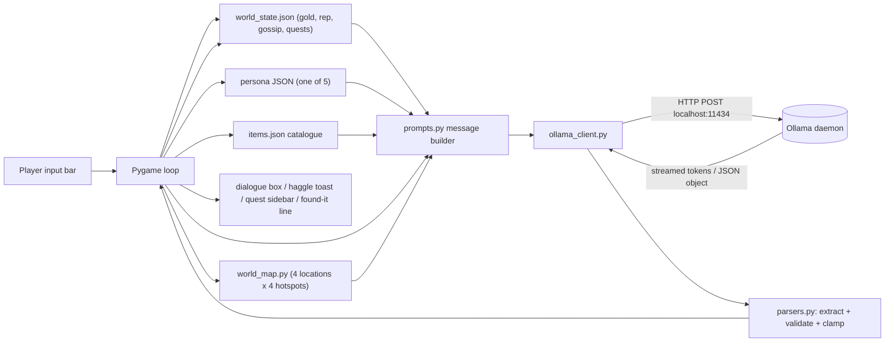

# Ollama Plan

This document covers everything the integration relies on: model
choice, when inference happens, the data path through the game, the
prompt structures we use, and the risks we are explicitly mitigating.

---

## 1. Model choice

| Tag                    | Params | Approx VRAM/RAM | Default? | Notes                                                      |
| ---------------------- | ------ | --------------- | -------- | ---------------------------------------------------------- |
| `llama3.2:3b`          | 3.2 B  | ~3 GB CPU / 2 GB GPU | **yes**  | Strong instruction-following at small size. The default.   |
| `qwen2.5:3b-instruct`  | 3 B    | ~3 GB           | no       | Slightly better at JSON-mode in our tests.                 |
| `gemma2:2b`            | 2.6 B  | ~2 GB           | no       | Fastest fallback for low-RAM machines.                     |
| `llama3.1:8b`          | 8 B    | ~6 GB GPU       | no       | Best dialogue quality if you have the hardware.            |
| `mistral:7b-instruct`  | 7.2 B  | ~5 GB GPU       | no       | Honest middle ground.                                      |

The model is configurable via `--model <tag>` and via the in-game
settings menu (F2 → "Cycle model"), which iterates through whatever
`ollama list` reports as locally pulled.

We picked `llama3.2:3b` as the default because:

- it runs on a 16 GB / no-GPU laptop in real time (first token in
  ~1.5–2 s after the daemon warm-up),
- it follows persona constraints reliably across a 6-turn window,
- it is small enough that pulling it during the marker's setup step is
  not a 30-minute wait,
- its `format: "json"` output is clean enough that our parser rarely
  has to fall back.

---

## 2. When does inference happen?

Inference is triggered on three explicit player actions and never in
the background:

| Trigger                            | Mode            | Latency budget | Streamed? |
| ---------------------------------- | --------------- | -------------- | --------- |
| Player types a chat line + Enter   | chat            | < 2 s first token, < 6 s total | yes |
| Player runs `/sell <item> <price>` | JSON (haggle)   | < 4 s end-to-end | no       |
| Player runs `/quest`               | JSON (quest)    | < 4 s end-to-end | no       |
| Player clicks the right hotspot at a location | JSON (found-it) | < 3 s end-to-end | no |
| Player clicks "Regenerate" in F2   | chat (replay)   | same as chat   | yes       |

There is **no idle-time inference**, no ambient chatter, no NPC
self-monologue. Every model call is initiated by the player, which:

- keeps the daemon's resource usage predictable,
- keeps Ollama's KV cache warm via `keep_alive: 10m`,
- and means the cost of a model call always has a visible cause on
  screen, which helps the player learn what the LLM is for.

The chat path **streams** tokens to the dialogue box character-by-
character so that perceived latency is the time-to-first-token rather
than the time-to-finish. The JSON paths cannot be streamed mid-decision
(the schema requires a complete object), so they are intentionally
modal: the input bar locks while the customer "thinks", and a toast
explains why. End-to-end JSON latency on the default model is well
inside the 4-second budget on the test laptop.

---

## 3. Data flow



Key points the marker can see on tape:

- The persona JSON file is on disk and visible in any text editor.
- `data/savegame.json` updates after every haggle, quest, and (for
  gossip) every chat reply that mentions a rumour.
- `--demo` mode dumps `prompt_log_<timestamp>.jsonl` so every prompt
  *and* every reply for that session can be reviewed offline.

---

## 4. Prompt structure

We have three distinct prompt families. All three share two building
blocks (`_persona_card` and `_world_state_block` in
`src/llm/prompts.py`) so a refinement to either propagates everywhere.

### 4.1 Chat prompt (free-form)

```
SYSTEM:
  You are role-playing a single customer in a fantasy tavern.
  ... character rules (see CHAT_RULES in src/llm/prompts.py) ...

  --- Persona ---
  Name: ...
  Voice and manner: ...
  Private secret (DO NOT reveal unprompted): ...
  Coin purse (gold): ...
  Currently wants: ...
  Starting attitude: ...

  --- World state ---
  Tavern name: The Wandering Goblet
  Player gold: ...
  Tavern reputation: ...
  Recent gossip already in town: ...

USER+ASSISTANT (last 6 turns):
  ... most recent player/customer exchange ...

USER (current):
  ... whatever the player typed ...
```

Why these choices:

- **Persona re-injected every turn.** Drift was visible after ~6 turns
  in early playtests; pinning the persona in the system prompt keeps
  the voice stable.
- **Sliding 6-turn memory window.** Older turns drop out so latency
  stays bounded while voice consistency stays high.
- **Player gold appears in world state.** That lets a cunning customer
  realise the player is rich and adjust their haggling.

### 4.2 Haggle prompt (JSON-mode)

```
SYSTEM:
  ... HAGGLE_RULES (output schema + clamps) ...
  --- Persona ---  (same card)
  --- World state --- (same block)
  --- Item under negotiation ---
    item id (name): base shop price ... gold.
    Description: ...
    Your private fair price (your floor): ... gold.
    Your absolute maximum (coin purse): ... gold.
  --- Negotiation so far ---
    - Player offered N gold; you replied: ...
    ...

USER:
  The shopkeeper offers <item> for <N> gold. Decide ... Reply ONLY with JSON.
```

Output schema (Pydantic-validated):

```json
{
  "accept": true,
  "counter_offer": null,
  "line": "Done, but only because I like the smell.",
  "walk_away": false
}
```

Counter-offers are clamped into `[haggle_floor_pct * base_price,
budget_gold]`. Acceptances above the persona's budget are demoted to
"can't afford" — see `parse_haggle` in `src/llm/parsers.py`.

### 4.3 Quest prompt (JSON-mode)

Same persona + world-state preamble plus an *Available locations* block
listing every location id, name, blurb, and that location's four
hotspot ids. Output:

```json
{
  "title": "Find the Lost Lute",
  "summary": "...",
  "target": "the eastern bridge",
  "reward_gold": 12,
  "danger": "low",
  "location": "outskirts",
  "hotspot": "broken_bridge"
}
```

`reward_gold` is hard-bounded `[5, 40]` and `danger` is enum-clamped.
`location` is clamped to the set of known location ids (unknown values
fall back to `outskirts`); `hotspot` is clamped to that location's
table (a hotspot id from a different location is silently rewritten to
the chosen location's first hotspot). This pair is what drives the
exploration-mode map: the player walks to that location and the right
hotspot is the one that completes the quest.

### 4.4 Found-it prompt (JSON-mode)

Fired once, when the player clicks the correct hotspot. Tiny return:

```json
{ "line": "You ease open the rusted miner's cart and there it lies." }
```

The prompt receives the persona (the quest-giver), the world state, the
quest summary, the location and hotspot *names* (not ids), and a noun
phrase extracted from the quest summary so the model has a concrete
thing to mention ("the lost lute", "the broken sword", etc.). A
parse failure falls back to a canned line so the player is never
soft-locked at the end of a quest.

---

## 5. Risks and mitigations

| Risk                                                    | Mitigation                                                                                                            |
| ------------------------------------------------------- | --------------------------------------------------------------------------------------------------------------------- |
| **First-token latency on weak hardware**                | Default to a 3B model; stream tokens; `keep_alive: 10m` keeps the model warm between calls.                           |
| **Persona drift after a few turns**                     | Re-inject the full persona card in the system prompt every turn; cap memory at 6 turns.                              |
| **Hallucinated prices / accepting un-affordable deals** | JSON-mode + Pydantic validation + clamps in `parse_haggle`; demote impossible accepts to a counter-offer at budget.   |
| **Malformed JSON despite `format: "json"`**             | Robust extractor (`extract_json_object`) tolerates leading/trailing prose; one retry; then degrade to a canned reply. |
| **Repetitive gossip**                                   | `WorldState.add_gossip` dedupes lines; `MAX_GOSSIP=20` caps the list; chat temperature stays high (0.8) but JSON temperature is low (0.2). |
| **Model breaking character on jailbreak attempts**      | `CHAT_RULES` instructs explicit refusal in character; persona pinned every turn; we never strip the system prompt.    |
| **Daemon unavailable**                                  | Startup ping shows a warning toast with the fix; the input bar still accepts text and falls back to a degraded reply. |
| **Reproducibility for video evidence**                  | `--demo` flag with fixed seed and scripted inputs; `prompt_log_*.jsonl` records every prompt and reply.               |
| **Player privacy in chat**                              | All inference is local; no telemetry; no third-party API key configured anywhere.                                     |

---

## 6. What success looks like

- A first-token latency of ≤ 2 s on the default model on a 16 GB laptop.
- A < 5 % rate of degrade fallbacks across the haggle and quest paths.
- Five personas reliably distinguishable in two-line blind reads.
- One-pull setup: only `llama3.2:3b` needs to be on disk for the game
  to be fully functional, no extra adapters or LoRAs.
